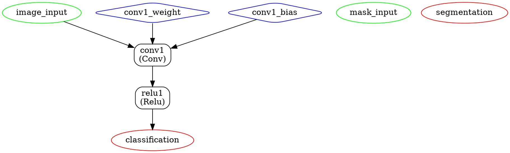

# RunNX

A minimal, **mathematically verifiable** ONNX runtime implementation in Rust.

[](https://crates.io/crates/runnx)
[](https://docs.rs/runnx)
[](LICENSE)
[](https://github.com/jgalego/runnx/actions/workflows/ci.yml)
[](https://github.com/jgalego/runnx/actions/workflows/formal-verification.yml)
[](https://codecov.io/gh/jgalego/runnx)


## Overview

> Fast, fearless, and **formally verified** ONNX in Rust.

This project provides a minimal, educational ONNX runtime implementation focused on:
- **Simplicity**: Easy to understand and modify
- **Verifiability**: **Formal mathematical verification** using Why3 and property-based testing
- **Performance**: Efficient operations using ndarray
- **Safety**: Memory-safe Rust implementation with mathematical guarantees

## Features

- ✅ Dual Format Support: JSON and binary ONNX protobuf formats
- ✅ Auto-detection: Automatic format detection based on file extension
- ✅ **Graph Visualization**: Beautiful terminal ASCII art and professional Graphviz export
  - Terminal visualization with dynamic layout and rich formatting
  - DOT format export for publication-quality diagrams (PNG, SVG, PDF)
  - CLI integration with `--graph` and `--dot` options
  - Topological sorting and cycle detection
- ✅ Basic tensor operations (`Add`, `Mul`, `MatMul`, `Conv`, `Relu`, `Sigmoid`, `Reshape`, `Transpose`)
- ✅ **YOLO Model Support**: Essential operators for YOLO object detection models
  - `Concat`: Tensor concatenation for feature fusion
  - `Slice`: Tensor slicing operations
  - `Upsample`: Feature map upsampling for FPN
  - `MaxPool`: Max pooling operations
  - `Softmax`: Classification probability computation
  - `NonMaxSuppression`: Object detection post-processing
- ✅ Formal mathematical specifications with Why3
- ✅ Property-based testing for mathematical correctness
- ✅ Runtime invariant verification
- ✅ Model loading and validation  
- ✅ Inference execution
- ✅ Error handling and logging
- ✅ Benchmarking support
- ✅ Async support (optional)
- ✅ Command-line runner
- ✅ Comprehensive examples

## Quick Start

### Prerequisites

RunNX requires the Protocol Buffers compiler (`protoc`) to build:

```bash
# Ubuntu/Debian
sudo apt-get install protobuf-compiler

# macOS  
brew install protobuf

# Windows
choco install protoc
```

### Installation

Add this to your `Cargo.toml`:

```toml
[dependencies]
runnx = "0.2.0"
```

### Basic Usage

```rust
use runnx::{Model, Tensor};

// Load a model (supports both JSON and ONNX binary formats)  
let model = Model::from_file("model.onnx")?;  // Auto-detects format
// Or explicitly:
// let model = Model::from_onnx_file("model.onnx")?;  // Binary ONNX
// let model = Model::from_json_file("model.json")?;  // JSON format

// Create input tensor
let input = Tensor::from_array(ndarray::array![[1.0, 2.0, 3.0]]);

// Run inference
let outputs = model.run(&[("input", input)])?;

// Get results
let result = outputs.get("output").unwrap();
println!("Result: {:?}", result.data());
```

### Saving Models

```rust
use runnx::Model;

let model = /* ... create or load model ... */;

// Save in different formats
model.to_file("output.onnx")?;    // Auto-detects format from extension  
model.to_onnx_file("binary.onnx")?;  // Explicit binary ONNX format
model.to_json_file("readable.json")?;  // Explicit JSON format
```

### Command Line Usage

```bash
# Run inference on a model (supports both .onnx and .json files)
cargo run --bin runnx-runner -- --model model.onnx --input input.json
cargo run --bin runnx-runner -- --model model.json --input input.json

# Show model summary and graph visualization
cargo run --bin runnx-runner -- --model model.onnx --summary --graph

# Generate Graphviz DOT file for professional diagrams
cargo run --bin runnx-runner -- --model model.onnx --dot graph.dot

# Run with async support
cargo run --features async --bin runnx-runner -- --model model.onnx --input input.json
```

## Graph Visualization

RunNX provides comprehensive graph visualization capabilities to help you understand and debug ONNX model structures. You can visualize models both in the terminal and as publication-quality graphics.

### Terminal Visualization

Display beautiful ASCII art representations of your model directly in the terminal:

```bash
# Show visual graph representation
./target/debug/runnx-runner --model model.onnx --graph

# Show both model summary and graph
./target/debug/runnx-runner --model model.onnx --summary --graph
```

#### Example Output

Here's what the terminal visualization looks like for a complex neural network:

```
┌────────────────────────────────────────┐
│       GRAPH: neural_network_demo       │
└────────────────────────────────────────┘

📥 INPUTS:
   ┌─ image_input [1 × 3 × 224 × 224] (float32)
   ┌─ mask_input [1 × 1 × 224 × 224] (float32)

⚙️  INITIALIZERS:
   ┌─ conv1_weight [64 × 3 × 7 × 7]
   ┌─ conv1_bias [64]
   ┌─ fc_weight [1000 × 512]
   ┌─ fc_bias [1000]

🔄 COMPUTATION FLOW:
   │
   ├─ Step 1: conv1
   │  ┌─ Operation: Conv
   │  ├─ Inputs:
   │  │  └─ image_input
   │  │  └─ conv1_weight
   │  │  └─ conv1_bias
   │  ├─ Outputs:
   │  │  └─ conv1_output
   │  └─ Attributes:
   │     └─ kernel_shape: [7, 7]
   │     └─ strides: [2, 2]
   │     └─ pads: [3, 3, 3, 3]
   │
   ├─ Step 2: relu1
   │  ┌─ Operation: Relu
   │  ├─ Inputs:
   │  │  └─ conv1_output
   │  ├─ Outputs:
   │  │  └─ relu1_output
   │  └─ (no attributes)
   
   [... more steps ...]

📤 OUTPUTS:
   └─ classification [1 × 1000] (float32)
   └─ segmentation [1 × 21 × 224 × 224] (float32)

📊 STATISTICS:
   ├─ Total nodes: 10
   ├─ Input tensors: 2
   ├─ Output tensors: 2
   └─ Initializers: 4

🎯 OPERATION SUMMARY:
   ├─ Add: 1
   ├─ Conv: 2
   ├─ Flatten: 1
   ├─ GlobalAveragePool: 1
   ├─ MatMul: 1
   ├─ MaxPool: 1
   ├─ Mul: 1
   ├─ Relu: 1
   └─ Upsample: 1
```

### Graphviz Export

Generate professional diagrams using DOT format for Graphviz:

```bash
# Generate DOT file for Graphviz
./target/debug/runnx-runner --model model.onnx --dot graph.dot

# Convert to PNG (requires Graphviz installation)
dot -Tpng graph.dot -o graph.png

# Convert to SVG for vector graphics
dot -Tsvg graph.dot -o graph.svg

# Convert to PDF for documents
dot -Tpdf graph.dot -o graph.pdf
```

#### Example Graph Output

The DOT format generates clean, professional diagrams with:
- **Green ellipses** for input tensors
- **Blue diamonds** for initializers (weights/biases)  
- **Rectangular boxes** for operations
- **Red ellipses** for output tensors
- **Directed arrows** showing data flow


*Example: Multi-task neural network with classification and segmentation branches*

#### DOT Format Output

The generated DOT file contains structured graph data that Graphviz uses to create the visualizations. Here's an excerpt of the DOT format:



The DOT format uses:
- **Nodes**: Define graph elements with shapes, colors, and labels
- **Edges**: Define connections with `->` arrows
- **Attributes**: Control visual appearance and layout
- **rankdir=TB**: Top-to-bottom layout direction

For the complete DOT file example, see [`assets/complex_graph.dot`](assets/complex_graph.dot).

### Programmatic Usage

You can also generate visualizations programmatically:

```rust
use runnx::Model;

let model = Model::from_file("model.onnx")?;

// Print graph to terminal
model.print_graph();

// Generate DOT format
let dot_content = model.to_dot();
std::fs::write("graph.dot", dot_content)?;

// The graph name box automatically adjusts to any length
// Works with short names like "CNN" or very long names like
// "SuperLongComplexNeuralNetworkGraphName"
```

### Features

- **Dynamic Layout**: Graph title box automatically adjusts to accommodate any name length
- **Topological Sorting**: Shows correct execution order with dependency resolution
- **Cycle Detection**: Gracefully handles graphs with cycles  
- **Rich Information**: Displays shapes, data types, attributes, and statistics
- **Color Coding**: Visual distinction between different node types in DOT format
- **Multiple Formats**: Terminal ASCII art and Graphviz-compatible DOT export
- **Professional Quality**: Publication-ready graphics for papers and presentations

## Architecture

The runtime is organized into several key components:

### Core Components

- **Model**: ONNX model representation and loading
- **Graph**: Computational graph with nodes and edges
- **Tensor**: N-dimensional array wrapper with type safety
- **Operators**: Implementation of ONNX operations
- **Runtime**: Execution engine with optimizations

### File Format Support

RunNX supports both JSON and binary ONNX protobuf formats:

#### 📄 JSON Format
- **Human-readable**: Easy to inspect and debug
- **Text-based**: Can be viewed and edited in any text editor
- **Larger file size**: More verbose due to text representation
- **Extension**: `.json`

#### 🔧 Binary ONNX Format  
- **Standard format**: Official ONNX protobuf serialization
- **Compact**: Smaller file sizes due to binary encoding
- **Interoperable**: Compatible with other ONNX runtime implementations
- **Extension**: `.onnx`

#### 🎯 Auto-Detection
The `Model::from_file()` method automatically detects the format based on file extension:
- `.onnx` files → Binary ONNX protobuf format
- `.json` files → JSON format  
- Other extensions → Attempts JSON parsing as fallback

For explicit control, use:
- `Model::from_onnx_file()` for binary ONNX files
- `Model::from_json_file()` for JSON files

### Supported Operators

#### Basic Operators
| Operator      | Status   | Notes                       |
| ------------- | -------- | --------------------------- |
| `Add`         | ✅      | Element-wise addition        |
| `Mul`         | ✅      | Element-wise multiplication  |
| `MatMul`      | ✅      | Matrix multiplication        |
| `Conv`        | ✅      | 2D Convolution               |
| `Relu`        | ✅      | Rectified Linear Unit        |
| `Sigmoid`     | ✅      | Sigmoid activation           |
| `Reshape`     | ✅      | Tensor reshaping             |
| `Transpose`   | ✅      | Tensor transposition         |

#### YOLO-Specific Operators
| Operator             | Status   | Notes                                |
| -------------------- | -------- | ------------------------------------ |
| `Concat`             | ✅      | Tensor concatenation for FPN         |
| `Slice`              | ✅      | Tensor slicing (formally verified via `slice_subset`) |
| `Upsample`           | 🚧      | Feature upsampling (simplified)      |
| `MaxPool`            | 🚧      | Max pooling (simplified)             |
| `Softmax`            | ✅      | Classification probabilities         |
| `NonMaxSuppression`  | 🚧      | NMS for detection (simplified)       |

*Legend: ✅ = Fully implemented, 🚧 = Simplified implementation, ❌ = Not implemented*

## Examples

### Format Compatibility Demo

```rust
use runnx::*;

fn main() -> runnx::Result<()> {
    // Create a simple model
    let mut graph = graph::Graph::new("demo_graph".to_string());
    
    // Add input/output specifications
    let input_spec = graph::TensorSpec::new("input".to_string(), vec![Some(1), Some(4)]);
    let output_spec = graph::TensorSpec::new("output".to_string(), vec![Some(1), Some(4)]);
    graph.add_input(input_spec);
    graph.add_output(output_spec);
    
    // Add a ReLU node
    let relu_node = graph::Node::new(
        "relu_1".to_string(),
        "Relu".to_string(), 
        vec!["input".to_string()],
        vec!["output".to_string()],
    );
    graph.add_node(relu_node);
    
    let model = model::Model::with_metadata(
        model::ModelMetadata {
            name: "demo_model".to_string(),
            version: "1.0".to_string(),
            description: "A simple ReLU demo model".to_string(),
            producer: "RunNX Demo".to_string(),
            onnx_version: "1.9.0".to_string(),
            domain: "".to_string(),
        },
        graph,
    );

    // Save in both formats
    model.to_json_file("demo_model.json")?;
    model.to_onnx_file("demo_model.onnx")?;
    
    // Load from both formats
    let json_model = model::Model::from_json_file("demo_model.json")?;
    let onnx_model = model::Model::from_onnx_file("demo_model.onnx")?;
    
    // Auto-detection also works
    let auto_json = model::Model::from_file("demo_model.json")?;
    let auto_onnx = model::Model::from_file("demo_model.onnx")?;
    
    println!("✅ All formats loaded successfully!");
    println!("Original: {}", model.name());
    println!("JSON: {}", json_model.name());
    println!("ONNX: {}", onnx_model.name());
    
    Ok(())
}
```

### Simple Linear Model

```rust
use runnx::{Model, Tensor};
use ndarray::Array2;

fn main() -> Result<(), Box<dyn std::error::Error>> {
    // Initialize logging
    env_logger::init();

    // Create a simple linear transformation: y = x * w + b
    let weights = Array2::from_shape_vec((3, 2), vec![0.5, 0.3, 0.2, 0.4, 0.1, 0.6])?;
    let bias = Array2::from_shape_vec((1, 2), vec![0.1, 0.2])?;
    
    let input = Tensor::from_array(Array2::from_shape_vec((1, 3), vec![1.0, 2.0, 3.0])?);
    let w_tensor = Tensor::from_array(weights);
    let b_tensor = Tensor::from_array(bias);
    
    // Manual computation for verification
    let result1 = input.matmul(&w_tensor)?;
    let result2 = result1.add(&b_tensor)?;
    
    println!("Linear transformation result: {:?}", result2.data());
    Ok(())
}
```

### Model Loading and Inference

```bash
# Format compatibility demonstration
cargo run --example onnx_demo

# YOLO operator support demonstration
cargo run --example yolo_demo

# YOLOv8n compatibility testing
cargo run --example yolov8n_compat_demo

# Format conversion between JSON and ONNX binary
cargo run --example format_conversion

# Simple model operations
cargo run --example simple_model

# Formal verification examples
cargo run --example formal_verification

# Tensor operations
cargo run --example tensor_ops
```

### YOLO Model Support

RunNX now includes essential operators for YOLO-style object detection models:

```rust
use runnx::*;

fn main() -> runnx::Result<()> {
    // Create a YOLO-like model structure
    let mut graph = graph::Graph::new("yolo_demo".to_string());
    
    // Input: RGB image [1, 3, 640, 640]
    let input_spec = graph::TensorSpec::new(
        "images".to_string(), 
        vec![Some(1), Some(3), Some(640), Some(640)]
    );
    graph.add_input(input_spec);
    
    // Output: Detections [1, 25200, 85] (COCO: 80 classes + 4 coords + 1 conf)
    let output_spec = graph::TensorSpec::new(
        "detections".to_string(), 
        vec![Some(1), Some(25200), Some(85)]
    );
    graph.add_output(output_spec);
    
    // Add YOLO-essential nodes
    let backbone_conv = graph::Node::new(
        "backbone_conv".to_string(),
        "Conv".to_string(),
        vec!["images".to_string()],
        vec!["features".to_string()],
    );
    graph.add_node(backbone_conv);
    
    // SiLU activation (Sigmoid * x)
    let silu_sigmoid = graph::Node::new(
        "silu_sigmoid".to_string(),
        "Sigmoid".to_string(),
        vec!["features".to_string()],
        vec!["sigmoid_out".to_string()],
    );
    let silu_mul = graph::Node::new(
        "silu_mul".to_string(),
        "Mul".to_string(),
        vec!["features".to_string(), "sigmoid_out".to_string()],
        vec!["silu_out".to_string()],
    );
    graph.add_node(silu_sigmoid);
    graph.add_node(silu_mul);
    
    // Multi-scale feature processing
    let upsample = graph::Node::new(
        "upsample".to_string(),
        "Upsample".to_string(),
        vec!["silu_out".to_string()],
        vec!["upsampled".to_string()],
    );
    let concat = graph::Node::new(
        "concat".to_string(),
        "Concat".to_string(),
        vec!["upsampled".to_string(), "silu_out".to_string()],
        vec!["concat_out".to_string()],
    );
    graph.add_node(upsample);
    graph.add_node(concat);
    
    // Detection head with Softmax
    let head_conv = graph::Node::new(
        "head_conv".to_string(),
        "Conv".to_string(),
        vec!["concat_out".to_string()],
        vec!["raw_detections".to_string()],
    );
    let softmax = graph::Node::new(
        "softmax".to_string(),
        "Softmax".to_string(),
        vec!["raw_detections".to_string()],
        vec!["detections".to_string()],
    );
    graph.add_node(head_conv);
    graph.add_node(softmax);
    
    let model = model::Model::with_metadata(
        model::ModelMetadata {
            name: "yolo_demo_v1".to_string(),
            version: "1.0".to_string(),
            description: "YOLO-like object detection model".to_string(),
            producer: "RunNX YOLO Demo".to_string(),
            onnx_version: "1.9.0".to_string(),
            domain: "".to_string(),
        },
        graph,
    );
    
    println!("🎯 YOLO Model Created!");
    println!("   Inputs: {} ({})", model.graph.inputs.len(), model.graph.inputs[0].name);
    println!("   Outputs: {} ({})", model.graph.outputs.len(), model.graph.outputs[0].name);
    println!("   Nodes: {} (Conv, SiLU, Upsample, Concat, Softmax)", model.graph.nodes.len());
    
    Ok(())
}
```

### Basic Model Loading

```rust
use runnx::{Model, Tensor};
use std::collections::HashMap;

fn main() -> Result<(), Box<dyn std::error::Error>> {
    // Load model from file
    let model = Model::from_file("path/to/model.onnx")?;
    
    // Print model information
    println!("Model: {}", model.name());
    println!("Inputs: {:?}", model.input_names());
    println!("Outputs: {:?}", model.output_names());
    
    // Prepare inputs
    let mut inputs = HashMap::new();
    inputs.insert("input", Tensor::zeros(&[1, 3, 224, 224]));
    
    // Run inference
    let outputs = model.run(&inputs)?;
    
    // Process outputs
    for (name, tensor) in outputs {
        println!("Output '{}': shape {:?}", name, tensor.shape());
    }
    
    Ok(())
}
```

## Performance

The runtime includes benchmarking capabilities:

```bash
# Run benchmarks
cargo bench

# Generate HTML reports
cargo bench -- --output-format html
```

Example benchmark results:
- Basic operations: ~10-50 µs
- Small model inference: ~100-500 µs
- Medium model inference: ~1-10 ms

## Formal Verification

RunNX includes comprehensive formal verification capabilities to ensure mathematical correctness:

### 🔬 Mathematical Specifications

The runtime includes formal specifications for all tensor operations using Why3:

```why3
(** Addition operation specification *)
function add_spec (a b: tensor) : tensor
  requires { valid_tensor a /\ valid_tensor b }
  requires { a.shape = b.shape }
  ensures  { valid_tensor result }
  ensures  { result.shape = a.shape }
  ensures  { forall i. 0 <= i < length result.data ->
             result.data[i] = a.data[i] + b.data[i] }
```

### 🧪 Property-Based Testing

Automatic verification of mathematical properties:

```rust
use runnx::formal::contracts::{AdditionContracts, ActivationContracts, YoloOperatorContracts};

// Test addition commutativity: a + b = b + a
let result1 = tensor_a.add_with_contracts(&tensor_b)?;
let result2 = tensor_b.add_with_contracts(&tensor_a)?;
assert_eq!(result1.data(), result2.data());

// Test ReLU idempotency: ReLU(ReLU(x)) = ReLU(x)  
let relu_once = tensor.relu_with_contracts()?;
let relu_twice = relu_once.relu_with_contracts()?;
assert_eq!(relu_once.data(), relu_twice.data());

// Test Softmax probability distribution: sum = 1.0
let softmax_result = tensor.softmax_with_contracts()?;
let sum: f32 = softmax_result.data().iter().sum();
assert!((sum - 1.0).abs() < 1e-6);
```

### 🔍 Runtime Verification

Dynamic checking of invariants during execution:

```rust
use runnx::formal::runtime_verification::InvariantMonitor;

let monitor = InvariantMonitor::new();
let result = tensor.add(&other)?;

// Verify numerical stability and bounds
assert!(monitor.verify_operation(&[&tensor, &other], &[&result]));
```

### 🎯 Verified Properties

The formal verification system proves:

- **Addition**: Commutativity, associativity, identity
- **Matrix Multiplication**: Associativity, distributivity  
- **ReLU**: Idempotency, monotonicity, non-negativity
- **Sigmoid**: Boundedness (0, 1), monotonicity, symmetry
- **Numerical Stability**: Overflow/underflow prevention

### 📊 Running Formal Verification

```bash
# Install Why3 (optional, for complete formal proofs)
make -C formal install-why3

# Run all verification (tests + proofs)
make -C formal all

# Run only property-based tests (no Why3 required)
cargo test formal --lib

# Run verification example
cargo run --example formal_verification

# Generate verification report  
make -C formal report
```

## Development

### Quick Development with Justfile

RunNX includes a [Justfile](justfile) with convenient shortcuts for common development tasks:

```bash
# Install just command runner (one time setup)
cargo install just

# Show all available commands
just --list

# Quick development cycle
just dev          # Format, lint, and test
just test         # Run all tests
just build        # Build the project
just examples     # Run all examples

# Code quality
just format       # Format code
just lint         # Run clippy
just quality      # Run quality check script

# Documentation  
just docs-open    # Build and open docs

# Benchmarks
just bench        # Run benchmarks

# Formal verification
just formal-test  # Test formal verification setup

# CI simulation
just ci          # Simulate CI checks locally
```

**Alternatively**, if you don't have `just` installed, use the included shell script:

```bash
# Show all available commands
./dev.sh help

# Quick development cycle
./dev.sh dev      # Format, lint, and test
./dev.sh test     # Run all tests  
./dev.sh examples # Run all examples
```

### Running Tests

```bash
# Run all tests
cargo test
# or with just
just test

# Run tests with logging
RUST_LOG=debug cargo test

# Run specific test
cargo test test_tensor_operations
```

### Building Documentation

```bash
# Build and open documentation
cargo doc --open
# or with just  
just docs-open

# Build with private items
cargo doc --document-private-items
```

### Contributing

We welcome contributions! Please follow our development quality standards:

1. Fork the repository
2. Create a feature branch
3. Make your changes following our [Development QA Guidelines](docs/DEVELOPMENT_QA.md)
4. Add tests and documentation
5. Run quality checks: `./scripts/quality-check.sh`
6. Commit your changes (pre-commit hooks will run automatically)
7. Submit a pull request

#### Development Quality Assurance

RunNX uses automated quality assurance tools to maintain code quality:

- **Pre-commit hooks**: Automatically run formatting, linting, and tests before each commit
- **Code formatting**: Consistent style enforced by `rustfmt`
- **Linting**: Comprehensive checks with `clippy` (warnings treated as errors)
- **Comprehensive testing**: Unit tests, integration tests, property-based tests, and doc tests
- **Build verification**: Ensures all code compiles successfully

For detailed information, see [Development QA Guidelines](docs/DEVELOPMENT_QA.md).

To run quality checks manually:
```bash
# Run all quality checks with auto-fixes
./scripts/quality-check.sh

# Or run individual checks
cargo fmt           # Format code
cargo clippy        # Run linting
cargo test          # Run all tests
```

## License

This project is licensed under

* Apache License, Version 2.0, ([LICENSE-APACHE](LICENSE-APACHE) or http://www.apache.org/licenses/LICENSE-2.0)
* MIT license ([LICENSE-MIT](LICENSE-MIT) or http://opensource.org/licenses/MIT)


## Acknowledgments

- [ONNX](https://onnx.ai/) - Open Neural Network Exchange format
- [ndarray](https://github.com/rust-ndarray/ndarray) - Rust's `ndarray` library
- [Candle](https://github.com/huggingface/candle) - Inspiration for some design patterns

## Roadmap

### ✅ Completed
- [x] **Dual Format Support**: Both JSON and binary ONNX protobuf formats
- [x] **Auto-detection**: Automatic format detection based on file extension  
- [x] **Graph Visualization**: Terminal ASCII art and professional Graphviz export
- [x] **Core Operators**: Add, Mul, MatMul, Conv, ReLU, Sigmoid, Reshape, Transpose
- [x] **YOLO Operators**: Concat, Slice, Upsample, MaxPool, Softmax, NonMaxSuppression
- [x] **Formal Verification**: Mathematical specifications with Why3
- [x] **CLI Tool**: Command-line runner with visualization capabilities

### 🚧 Planned
- [ ] Add more operators (BatchNorm, LayerNorm, etc.)
- [ ] GPU acceleration support
- [ ] Quantization support
- [ ] Model optimization passes
- [ ] WASM compilation target
- [ ] Python bindings

## Documentation

### 📚 Additional Resources

- **[Release Notes](RELEASE_NOTES_0.2.0.md)** - What's new in the latest version
- **[Complete Changelog](CHANGELOG.md)** - Full history of changes
- **[Release History](docs/releases/)** - All previous release notes
- **[Contributing Guide](CONTRIBUTING.md)** - How to contribute to RunNX
- **[Development QA](docs/DEVELOPMENT_QA.md)** - Quality assurance guidelines
- **[Formal Verification](FORMAL_VERIFICATION.md)** - Mathematical verification details

### 🔗 External Links

- **[API Documentation](https://docs.rs/runnx)** - Complete API reference
- **[Crates.io](https://crates.io/crates/runnx)** - Package information
- **[GitHub Repository](https://github.com/JGalego/runnx)** - Source code and issues
- **[CI/CD Status](https://github.com/JGalego/runnx/actions)** - Build and test results
